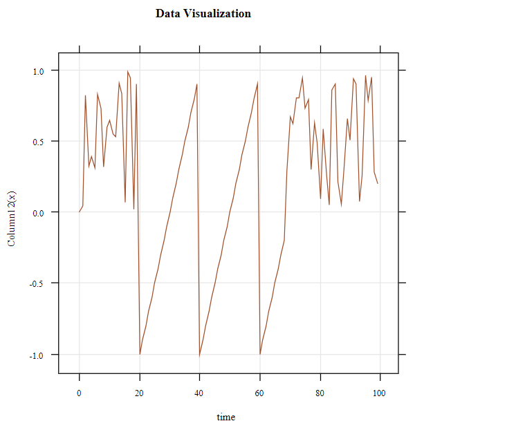

## Big Data Project 1

> In this project, I created a program that use R plot function over 
> GraalVM as a Spring Boot project. Project reads values from a file which is added into resources folder
> and uses these values as a y axis-values by using R plot function over GraalVm.

> 1. Clone the project.
> 2. Go to the path like ...../Desktop/bigdata
> 3. Run the project from the command line: mvn spring-boot:run
> 4. Use this link on the browser: http://localhost:8080/plot

> Result:
> 

